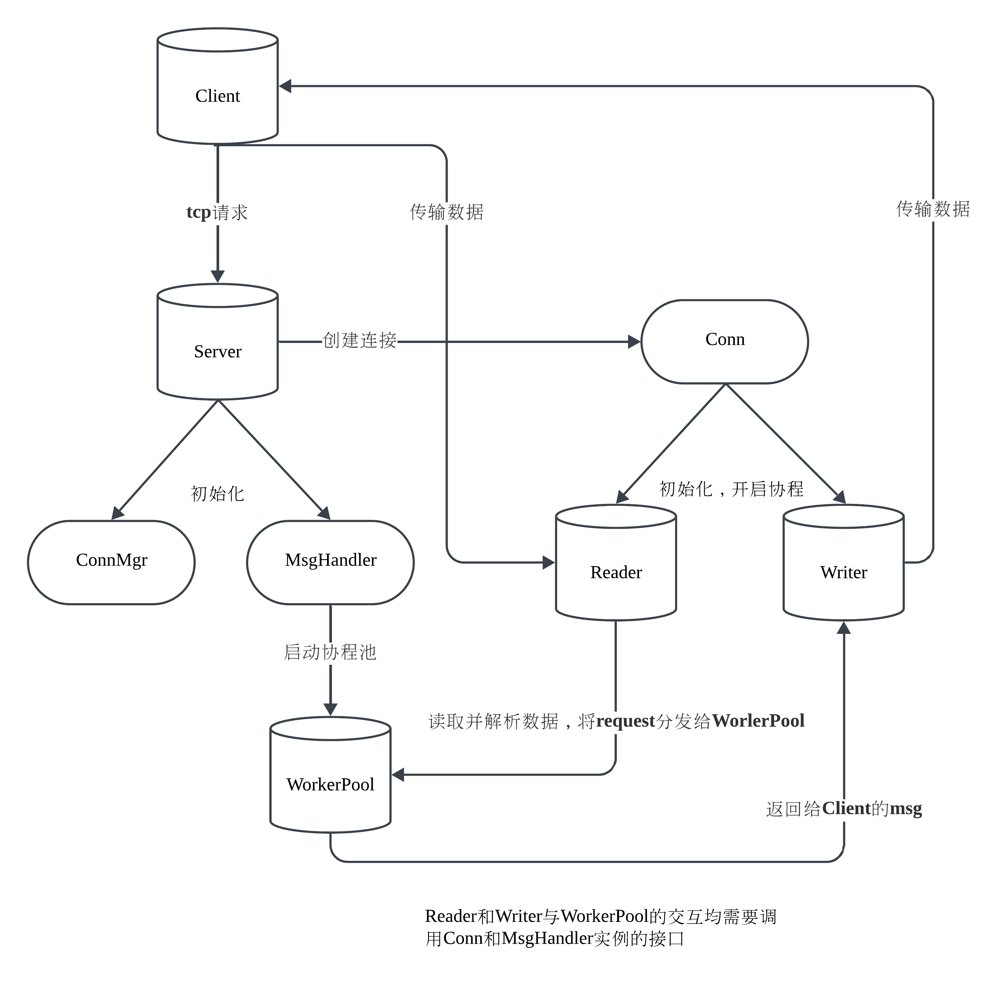

# cinx

基于 Go 语言开发的轻量级TCP长连接并发服务器框架。

  - 并发处理模型：采用协程池与任务队列结合的设计，分离读写协程实现 I/O 与业务逻辑并发处理，支持万级并发连接。
  - 高效传输协议：基于 TLV 格式的二进制协议实现，有效解决 TCP 粘包/拆包问题。
  - 架构设计：服务器状态管理、连接管理器、可扩展协议接口。
  - 场景组件：心跳检测与断线重连机制。



### 代码开发中的问题与解决方案

1. 客户端初始化与发送逻辑顺序问题

    现象 ：编写测试代码时发现客户端在未完成初始化时就执行发送逻辑，导致空指针异常。

    原因分析 ：

    代码中多处使用协程并发执行，由于协程调度顺序的不确定性，导致以下执行顺序错误：

    - 客户端连接尚未完成初始化

    - 需要连接对象的发送逻辑已提前执行

    解决方案 ：

    - 引入ready管道作为协程同步信号
    
    - 调整关键节点的协程启动顺序
    
    - 保留必要的并发逻辑（非关键路径保持并发执行）

2. 高并发场景下的服务端稳定性问题

    现象 ：压力测试时出现端口耗尽导致客户端异常断开，进而引发服务端崩溃。

    问题本质 ：

    - 连接异常处理机制缺陷
    
    - 并发协程间的资源竞争
    
    - 连接关闭时的任务执行完整性问题

    改进方案 ：

    - 状态管理 ：
        
        - 新增原子变量标记连接状态
        
        - 使用sync.WaitGroup跟踪任务执行
    
    - 执行流程优化 ：

        ```
        // 连接异常处理流程
        reader检测异常 -> 设置关闭状态 -> 触发stop流程 -> 
        wg.Wait等待已接收任务 -> workpool继续执行遗留任务 -> 
        writer无脑发送（忽略错误） -> wg.Done -> 清理资源（关闭msg管道等）
        ```

    - 容错设计 ：
        - 任务提交阶段不进行连接状态检查
    
        - 写协程统一处理发送异常
        
        - 提供用户级熔断接口（通过handler提前return实现）

    - 性能考量 ：

        - 采用"尽力而为"策略处理异常连接的任务
        
        - 通过wg.Wait()保证已接收任务执行完毕
        
        - 优雅关闭时确保：

            - reader先行退出
            
            - writer处理完消息队列
            
            - 管道关闭时无残留数据

    经验总结：

    - 协程同步应优先使用简单同步原语
    
    - 资源释放需保证执行完整性
    
    - 异常处理应区分系统级和业务级容错
    
    - 避免过度设计，当前方案在代码复杂度和功能需求间取得平衡

3. 服务端异步启动后 stop 在大量并发连接下的死锁问题

    现象：服务端在异步启动后调用 Stop 方法时，面对大量并发连接场景，程序因死锁异常退出。
    
    问题本质 ：

    - 锁竞争与链式调用 ：

        - 原connmanager模块使用sync.Mutex保护连接集合（map），Stop操作需遍历所有连并逐个调用conn.Stop()。
        
        - conn.Stop()内部可能再次申请锁（如连接自身的状态锁），导致嵌套锁竞争 。

        - 当connmanager的锁未释放时，调用conn.Stop()可能因等待连接内部锁而阻塞，形成死锁链。
    - 资源清理顺序缺陷 ：
        
        - 未明确资源释放的优先级，导致连接关闭时可能仍在处理旧任务或接收新请求。
    
    解决方案 ：

    - 数据结构优化 ：
        - 替换为sync.Map ：
            将连接集合从普通map+Mutex替换为sync.Map，利用其无锁并发特性，避免遍历时的锁竞争。
        - 原子状态管理 ：
            使用atomic包标记服务端状态，确保状态变更的原子性，避免竞态。
        
    经验总结 ：

    - 避免嵌套锁 ：优先使用并发安全的数据结构（如sync.Map）减少锁粒度。
    - 资源生命周期管理 ：明确资源创建、使用、销毁的顺序，避免循环依赖。
    - 优雅退出设计 ：
        - 分阶段关闭（先停读，再停写，最后清理）。
        - 通过原子状态和WaitGroup确保执行完整性。
    - 压测验证必要性 ：高并发场景必须通过压力测试暴露隐藏的竞态和死锁问题。